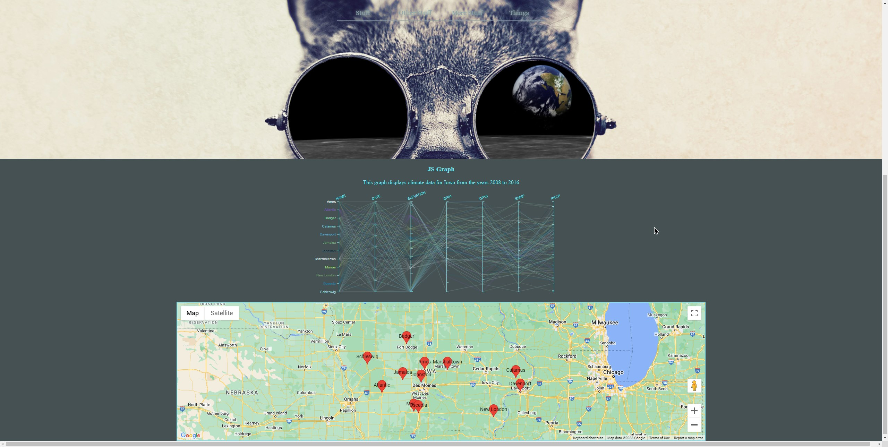
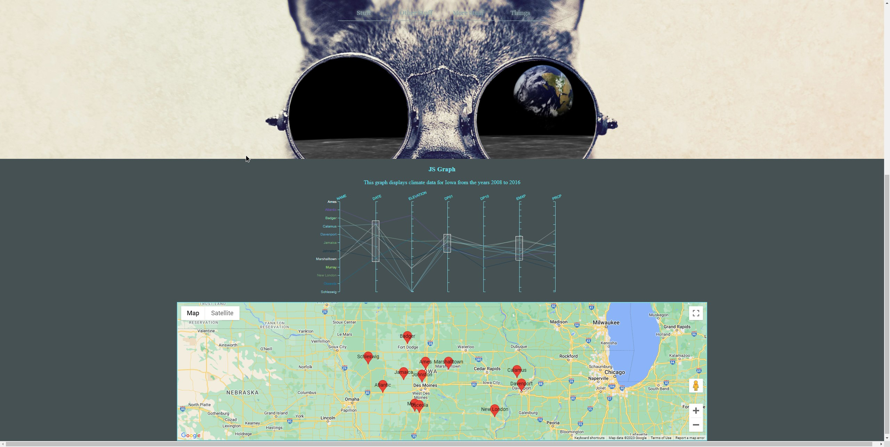

this website was used as a way to test my javascript skills. it has an interactive graph displaying weather data that is stored in a local csv file along with a google maps API implementation displaying the locations of the various data points.

